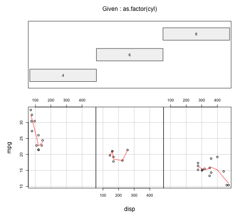

## Introduccion 


## Tabla construida con lenguaje de marcadores 
Para la creación de este github se empleo la base de datos mtcars que esta incluida por defecto en data sets de r.
Librerias necesarias 


```r
library(knitr);library(kableExtra);library(ggplot2)
```

Creación de la tabla

```r
data("mtcars")
kable(head(mtcars,5))
```


|                  |  mpg| cyl| disp|  hp| drat|    wt|  qsec| vs| am| gear| carb|
|:-----------------|----:|---:|----:|---:|----:|-----:|-----:|--:|--:|----:|----:|
|Mazda RX4         | 21.0|   6|  160| 110| 3.90| 2.620| 16.46|  0|  1|    4|    4|
|Mazda RX4 Wag     | 21.0|   6|  160| 110| 3.90| 2.875| 17.02|  0|  1|    4|    4|
|Datsun 710        | 22.8|   4|  108|  93| 3.85| 2.320| 18.61|  1|  1|    4|    1|
|Hornet 4 Drive    | 21.4|   6|  258| 110| 3.08| 3.215| 19.44|  1|  0|    3|    1|
|Hornet Sportabout | 18.7|   8|  360| 175| 3.15| 3.440| 17.02|  0|  0|    3|    2|


---

## Grafica o imagen estática  

```r
require(graphics)
coplot(mpg ~ disp | as.factor(cyl), data = mtcars, panel = panel.smooth, rows = 1)
```




---

## Imagen estatica  
      

---

## Grafica con ggplot2


```r
qplot(x=carat, binwidth=0.25, data = diamonds)
```


